# OCR Benchmark - Complete Flow Explanation

## 🎯 Overview

This benchmark system compares OCR (Optical Character Recognition) results from **3 models**:
- **PaddleOCR** - Runs locally (no API needed)
- **Doctr** - Via RunPod API endpoint  
- **Surya** - Via RunPod API endpoint

```mermaid
flowchart TD
    A["📁 Image Source<br/>(Local / URL / R2)"] --> B["🔄 Image Loader"]
    B --> C["Base64 Encode"]
    
    C --> D1["🏠 PaddleOCR<br/>(Local)"]
    C --> D2["☁️ Doctr API<br/>(RunPod)"]
    C --> D3["☁️ Surya API<br/>(RunPod)"]
    
    D1 --> E1["OCR Result 1"]
    D2 --> E2["OCR Result 2"]
    D3 --> E3["OCR Result 3"]
    
    F["📝 Ground Truth<br/>(from R2)"] --> G["Similarity Engine"]
    E1 --> G
    E2 --> G
    E3 --> G
    
    G --> H["📊 HTML Report"]
    G --> I["📄 Text Comparison"]
    
    H --> J["☁️ Upload to R2"]
    J --> K["🔗 Presigned URL"]
    K --> L["📋 GitHub Summary"]
```



---

## 📂 Code Structure

```
OCR_Benchmark/
├── ocr_runner/                 # Core OCR Package
│   ├── __init__.py            # Exports run_ocr, OCRResult
│   ├── ocr_router.py          # Routes to correct engine (doctr/surya/paddle)
│   ├── paddle_local.py        # Local PaddleOCR implementation
│   ├── similarity_logic.py    # Word-level comparison algorithm
│   └── text_processor.py      # Text extraction & formatting
│
├── scripts/                    # CLI Tools
│   ├── run_ocr_cli.py         # Run OCR on single image
│   ├── compare_outputs.py     # Compare two text outputs
│   ├── generate_html_report.py # Generate HTML benchmark report
│   ├── compare_web_ui.py      # Local web dashboard server
│   └── download_from_r2.py    # Download files from R2
│
├── .github/workflows/
│   └── ocr_benchmark.yml      # GitHub Actions workflow
│
├── test_inputs/               # Test images & ground truth
├── test_outputs/              # Generated outputs
├── .env                       # API keys (not committed)
└── .env.example               # Template for .env
```

---

## 🔄 Step-by-Step Flow

### Step 1: Image Input
```python
# Image can be from:
# - Local file: "test_inputs/image.jpg"
# - URL: "https://example.com/image.jpg"
# - R2 bucket: "r2://bucket-name/path/image.jpg"

image_path = "r2://ocr-benchmark/documents/invoice_001.jpg"
```

### Step 2: OCR Routing ([ocr_router.py](file:///Users/deep/OCR_Benchmark/ocr_runner/ocr_router.py))
```python
from ocr_runner import run_ocr

# Route to appropriate engine based on model
result_paddle = run_ocr(image_path, "paddle")   # Local
result_doctr = run_ocr(image_path, "doctr")     # API
result_surya = run_ocr(image_path, "surya")     # API
```

**Each result contains:**
```python
OCRResult(
    model="paddle",
    custom_text="Full extracted text...",
    text="Raw text...",
    words=[{"text": "Invoice", "bbox": [x1,y1,x2,y2]}, ...],
    success=True
)
```

### Step 3: Ground Truth Loading
```python
# Ground truth is stored as JSON in R2
gt_data = download_from_r2("r2://bucket/gt/invoice_001_ct.json")
gt_text = gt_data["custom_text"]
```

### Step 4: Similarity Computation ([similarity_logic.py](file:///Users/deep/OCR_Benchmark/ocr_runner/similarity_logic.py))
```python
from ocr_runner.similarity_logic import compute_similarity

result = compute_similarity(gt_text, ocr_text)
# Returns:
#   similarity_score: 94.5%
#   correct_words: 189
#   missing_words: ["amount", "due"]
#   incorrect_words: 10
```

**Algorithm:**
1. Normalize both texts (lowercase, remove punctuation)
2. Tokenize into words
3. Count word frequency matches
4. Calculate: `score = (correct_words / total_gt_words) × 100`

### Step 5: Generate Reports
```bash
# Text report
python scripts/compare_outputs.py \
  --reference ground_truth.txt \
  --compare ocr_output.txt \
  --output comparison.txt

# HTML report
python scripts/generate_html_report.py \
  --model paddle \
  --ocr-text outputs/paddle.txt \
  --gt-text ground_truth.txt \
  --output report.html
```

### Step 6: Upload & Share (GitHub Actions)
```yaml
# Upload HTML to R2
mc cp report.html r2/bucket/reports/run-123/report.html

# Generate presigned URL (7 days)
REPORT_URL=$(mc share download --expire=168h r2/bucket/reports/run-123/report.html)

# Show in GitHub Summary
echo "[📊 View Report]($REPORT_URL)" >> $GITHUB_STEP_SUMMARY
```

---

## 🚀 Quick Start Commands

### Local Testing
```bash
# 1. Set up environment
cp .env.example .env
# Edit .env with your RUNPOD_API_KEY

# 2. Run PaddleOCR locally (no API needed)
python scripts/run_ocr_cli.py \
  --image test_inputs/input_1_small.jpg \
  --model paddle \
  --output-text outputs/paddle.txt

# 3. Run Doctr via API
python scripts/run_ocr_cli.py \
  --image test_inputs/input_1_small.jpg \
  --model doctr \
  --output-text outputs/doctr.txt

# 4. Compare outputs
python scripts/compare_outputs.py \
  --reference test_inputs/input_1_ct.json \
  --compare outputs/paddle.txt
```

### GitHub Actions Trigger
```bash
# Via GitHub UI: Actions → OCR Benchmark → Run workflow
# Fill in:
#   image_source: r2://bucket/image.jpg
#   model: paddle
#   gt_source: r2://bucket/gt.json
#   compare_model: doctr
```

---

## 📊 Output Examples

### Text Comparison Report
```
============================================================
OCR COMPARISON REPORT
============================================================
Source 1 (Reference)
Source 2 (Compare)
------------------------------------------------------------
Similarity Score  : 94.50%
Total Words (S1)  : 200
Correct Words     : 189
Missing/Incorrect : 11
------------------------------------------------------------
Missing Words:
  - 'medication' (x2)
  - 'dosage'
============================================================
```

### HTML Report Features
- 📊 Similarity score gauge
- 📝 Side-by-side text comparison
- ❌ Missing words highlighted
- ➕ Extra words shown
- 📄 Embedded image preview (base64)
